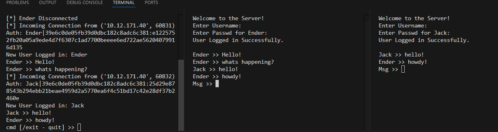

# PySockets - Chatroom

## What is a Chatroom
A digital chatroom is a virtual communication space that enables real-time, text-based interaction among multiple participants. It operates over the internet and is designed to facilitate instant, synchronous conversations, allowing users to share messages, links, and multimedia in a single, shared environment. Chatrooms are commonly organized by topics or themes, enabling focused discussions among participants with shared interests, whether for professional collaboration, customer support, community engagement, or social interaction.

Modern chatrooms often integrate advanced features such as user authentication, message encryption, private channels, and moderation tools to maintain a secure and productive environment. Additionally, they may support multimedia content, enabling users to share files, images, or videos directly within the conversation. By providing a structured yet flexible platform for real-time communication, digital chatrooms have become essential tools for fostering collaboration, building communities, and facilitating quick, interactive exchanges across various digital landscapes.

## How do I run this? :wrench:
**Server Side** :desktop_computer:
```bash
# or py.exe for Windows
python3 Server.py
```
**Client Side** :computer:
```bash
# or py.exe for Windows
python3 Client.py [IPv4] [PORT]
```

